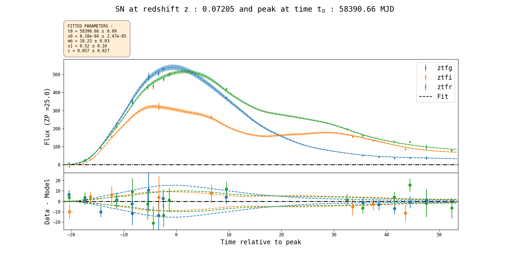
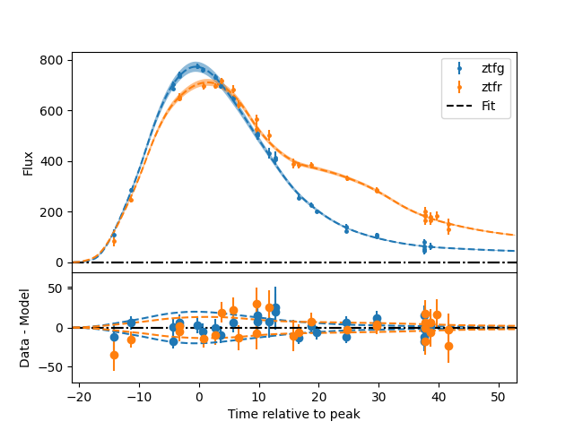
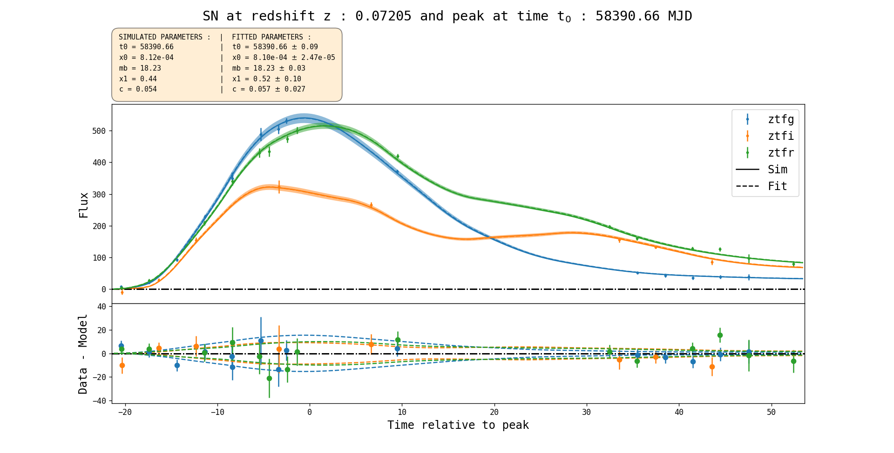
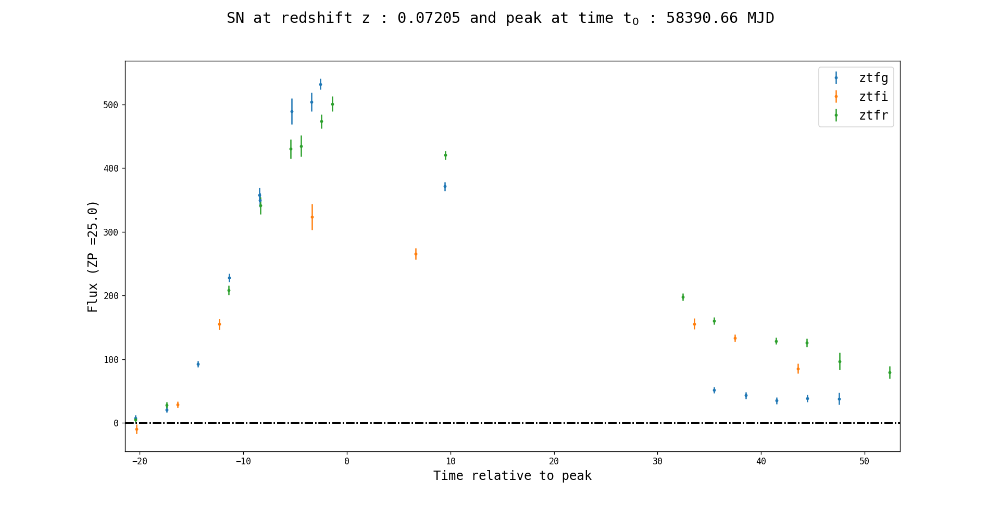
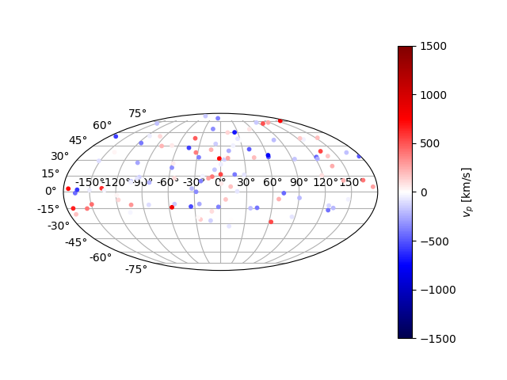
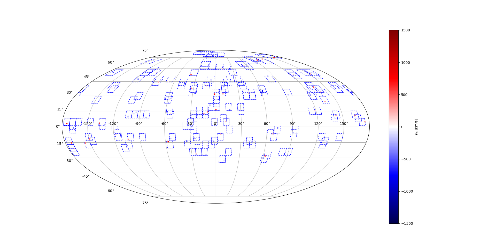
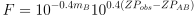
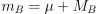
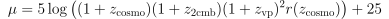
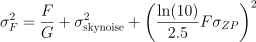

# Code for simulation of SN Ia using sn cosmo
## Installation
In the setup.py directory use:
```
>python -m pip setup .
```
## Input file :
The input file is a .yml with the following structure:
```yaml
data :
    write_path: '/PATH/TO/OUTPUT'
    sim_name: 'NAME OF SIMULATION'
    write_format: 'format' or ['format1','format2'] #(Optional default pkl, fits)
survey_config:
    survey_file: '/PATH/TO/FILE'
    band_dic: {'r':'ztfr','g':'ztfg','i':'ztfi'} #(Optional -> if bandname in the database doesn't correpond to those in sncosmo registery)
    add_data: ['keys1', 'keys2', ...] #(Optional add survey file keys to metadata)
    db_cut: {'key1': ["conditon1","conditon2",...], 'key2':["conditon1"],...} #(Optional SQL conditions on key)
    zp: INSTRUMENTAL ZEROPOINT  #(Optional, default given by survey file)
    sig_zp: UNCERTAINTY ON ZEROPOINT #(Optional, default given by survey file)
    ra_size: RA FIELD SIZE in DEG
    dec_size: DEC FIELD SIZE in DEG
    gain: CCD GAIN e-/ADU
    start_day: MJD NUMBER or 'YYYY-MM-DD' #(Optional, default given by survey file)
    end_day: MJD NUMBER or 'YYYY-MM-DD' #(Optional, default given by survey file)
    duration: SURVEY DURATION (DAYS) #(Optional, default given by survey file)
sn_gen:
    n_sn: NUMBER OF SN TO GENERATE #(Optional)
    duration_for_rate: FAKE DURATION ONLY USE TO GENERATE N SN (DAYS) #(Optional)
    sn_rate: rate of SN/Mpc^3/year #(Optional, default=3e-5)
    rate_pw: rate = sn_rate*(1+z)^rate_pw #(Optional, default=0)
    nep_cut: [[nep_min1,Tmin,Tmax],[nep_min2,Tmin2,Tmax2,'filter1'],...] EP CUTS #(Optional defaut >= 1 ep)
    randseed: RANDSEED TO REPRODUCE SIMULATION #(Optional default random)
    z_range: [ZMIN, ZMAX] # Cosmological redshift range
    M0: SN ABSOLUT MAGNITUDE
    mag_smear: SN INTRINSIC SMEARING
    smear_mod: 'G10','C11_i' USE WAVELENGHT DEP MODEL FOR SN INT SCATTERING
cosmology: # Follow astropy formalism
    Om0: MATTER DENSITY  
    H0: HUBBLE CONSTANT
cmb:
    v_cmb: OUR PECULIAR VELOCITY #(Optional, default = 369.82 km/s)
    ra_cmb: RIGHT ASCENSION OF CMB DIPOLE #(Optional, default = 266.81)
    dec_cmb: DECLINAISON OF CMB DIPOLE #(Optional, default = 48.253)
model_config:
    model_name: 'THE MODEL NAME' # Example : 'salt2'
    model_dir: '/PATH/TO/SALT/MODEL'  
    # Model parameters (here example for salt2)
    alpha: STRETCH CORRECTION = alpha*x1
    beta: COLOR CORRECTION = -beta*c   
    mean_x1: MEAN X1 VALUE
    mean_c: MEAN C VALUE
    sig_x1: SIGMA X1 or [SIGMA_X1_LOW, SIGMA_X1_HIGH]  
    sig_c: SIGMA C or [SIGMA_C_LOW, SIGMA_C_HIGH]
 vpec_gen:
     mean_vpec: MEAN SN PECULIAR VEL
     sig_vpec: SIGMA VPEC
 host_file: '/PATH/TO/HOSTFILE' # Optional

```
* If you set end_day and duration, duration will be ignored
* If the name of bands in the db file doesn't match sncosmo bands you can use the key band_dic to translate filters names
* If you don't set the filter name item in nep_cut, the cut apply to all the band
* For wavelength dependent model, nomanclature follow arXiv:1209.2482 -> 'G10' for Guy et al. 2010 model, 'C11' or 'C11_0' for Chotard et al. model with correlation between U' and U = 0, 'C11_1' for Cor(U',U) = 1 and 'C11_2' for Cor(U',U) = -1

## Observation DataBase file:
It's a sql database file which contain cadence information. It's used to find obs epoch and their noise.

The required data keys are resumed in the next table

|     expMJD     | filter   | fieldID             | fieldRA (rad)                   |  fieldDec (rad)              | zp                            | sig_zp |
| :-----------:  | :-----:  | :-----------------: | :-----------------------------: | :--------------------------: | :---------------------------: | :------: |
| Obs time in MJD| Obs band | The ID of the field | Right ascension of the obs field| Declinaison of the obs field | Zero point of the observation (Optional if given in yaml) | Uncertainty of the zeropoint (Optional if given in yaml) |

## Host file
The host file contain coordinates and peculiar velocities to simulate SN, the needed keys are given in the next table

| redshift | ra (rad) | dec (rad) | vp_sight (km/s) |
| :-----------: | :-----: | :----------: | :----------: |
| Redshift of the host | Right ascension of the host | Declinaison of the host | Velocity along the line of sight |

## Usage and output
```python
from snsim import Simulator

sim = Simulator('yaml_cfg_file.yml')
sim.simulate()
```

The result is stored in sim.sn_list list which each entry is a SN object. Simulated lc and metadata are given by :
```python
sim.sn_list[i].sim_lc
sim.sn_list[i].sim_lc.meta

#  For more information :
help(snsim.SN)
```
The basic list of ligth curves metadata is given in the following table :

| z |  sim_t0   | vpec (km/s) | zcos | zpec | z2cmb | zCMB | ra (rad) | dec (rad) |  sn id   | sim_mu | m_smear |
| :------------:  | :------------: | :------------: | :------------: | :------------: | :------------: | :------------: | :------------: | :------------: | :------------: | :------------: | :------------: |
|  Observed redshift | Peaktime | Peculiar velocity  | Cosmological redshift  | Peculiar velocity redshift | CMB motion redshift | CMB frame redshift | SN right ascension   |  SN declinaison |  SN identification number | Simulated distance modulli | Coherent smear term |

If you use SALT2/3 model you add some arguments to metadata:


|         sim_x0          |      sim_x1       |      sim_c      |               sim_mb                |
| :---------------------: | :---------------: | :-------------: | :---------------------------------: |
| Normalization parameter | Stretch parameter | color parameter | SN magnitude in restframe Bessell B |

Moreover, if you use a scattering model like G10 or C11 the random seed used is stock in the meta too.

## Script launch

The program can be launch with the ./sripts/launch_sim.py python script.

The script use argparse to change parameters:
```shell
>python3 launch_sim.py '/PATH/TO/YAMLFILE' -fit (optional if you want to fit) --any_config_key value (overwrite yaml configuration or add param)
```
If the config keys is a float or an int just type as :
```shell
>python3 launch_sim.py '/PATH/TO/YAMLFILE' --int_or_float_key value_nbr
```
If the config key is a dict you have to pass it like a yaml string :
```shell
>python3 launch_sim.py '/PATH/TO/YAMLFILE' --dic_key "{'key1': value1, 'key2': value2, ...}"
```
If the config keys is a list you have to pass it by separate item by space :
```shell
>python3 launch_sim.py '/PATH/TO/YAMLFILE' --list_key item1 item2 item3
```
In the case of nep_cut key you can pass an int or pass list by typing --nep_cut multiple times, note that filter argument is optional:
```shell
#nep_cut is just an int
>python3 launch_sim.py '/PATH/TO/YAMLFILE' --nep_cut minimal_nbr_of_epoch

#Multiple cuts
>python3 launch_sim.py '/PATH/TO/YAMLFILE' --nep_cut ep_nbr1 time_inf1 time_sup1 optional_filter1 --nep_cut ep_nbr2 time_inf2 time_sup2 optional_filter2
```
## Plot functions  

You can plot simulated lightcurves

```
sim.plot_lc(SN_ID, mag=False, zp=25. , plot_sim=True, plot_fit=False, Jy=False)
```

Plot sim :



Plot  fit :



Plot sim and fit:



Just the data alone :



The same plot can be show in magnitude :


Or in Jansky :


You can also plot a vpec Mollweide map

```python
sim.plot_ra_dec(plot_vpec=False, plot_fields=False, **kwarg)
```

Plot without peculiar velocities :


Plot with peculiar velocities :



Adding the fields :



## Fit and OpenSim class

You can direct fit after running the simulation
```python
# Fit 1 lc by id
sim.fit_lc(id)

# Fit all the lcs
sim.fit_lc()

# Write the fit
sim.write_fit()
```
Or you can open register open sim file .fits or .pkl with the open_sim class
```python
from snsim import OpenSim

sim = OpenSim('sim_file.pkl/.fits',SALT2_dir)
```

## Simulation formula

The flux in ADU is simulated following the formula :



Where the magnitude in rest-frame Bessell B band m<sub>B</sub> is given by :



With M<sub>B</sub> the absolute magnitude of SN Ia in the Bessell B band.

The distance moduli is computed with the peculiar velocity effect :



Where z<sub>cosmo</sub> is the cosmological redshift, z<sub>2cmb</sub> is the redshift from our peculiar motion to the CMB frame and z<sub>vp</sub> is the redshift due to the peculiar velocity of the object.


The error is computed with the formula :



Where the first term is the poissonian random noise with G the CCD gain in e<sup>-</sup> / ADU, the second term is the skynoise computed with the limiting magnitude at 5 σ using :


The last term is the propagation to flux of the uncertainty on zero point determination.

