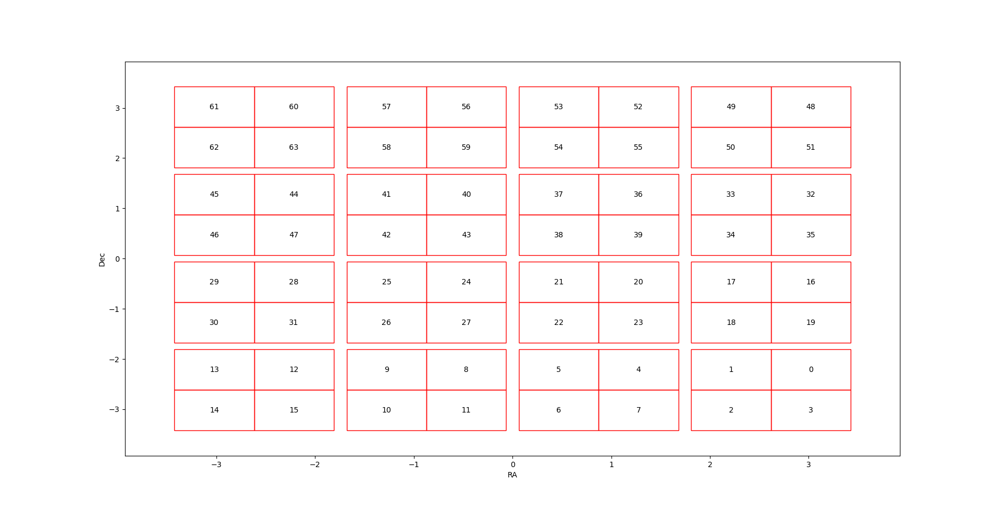

# Observation database file

It's a **SQL DataBase** (.db) or a **Comma-separated values ** (.csv) file which contain observations informations. It's used to find obs epoch and their noise.

The SQL Table inside the SQL DataBase must be named **Summary**.


## Required keys

The required data keys are resumed in the next table :

|     expMJD      |  filter  |       fieldID       |          fieldRA (rad)           |        fieldDec (rad)        |                       noise_key                       |
| :----------: | :----------:  | :----------: | :----------:  | :----------:  | :----------:  |
| Obs time in MJD | Obs band | The ID of the field | Right ascension of the obs field | Declinaison of the obs field | The column you want to use as noise in the simulation |

**noise_key** has to be defined in the [configuration yaml file](./configfile.md)

If you use **csv** file you can define a **key_dic** to change columns name to corresponds to what is needed.

You can set a different zero point and its error for each observation by setting the two additional columns:

|                            zp                             |                          sig_zp                          |
| :----------: | :----------: |
| Zero point of the observation (Optional if given in yaml) | Uncertainty of the zeropoint (Optional if given in yaml) |

In addition you can take into account the variation of the PSF as the **F**ull **W**idth at **H**alf **M**aximum $FWHM = 2 \sqrt{2 \log(2)} \sigma_{skynoise}$

|                  FWHMeff                  |
| :---------------------------------------: |
| The Full Width at Half Maximum of the PSF |

And you can set a different gain for each observation by giving the **gain** column :

|             **gain**              |
| :-------------------------------: |
| The CCD gain in e<sup>-</sup>/ADU |


## Subfields

If you want to use subfield index for observation properties or just set the geometry of the field, you have to give a .dat file that give the representation of the subfield, for example if you split your field into a 4 x 4 grid, you have to put something like that in your .dat file :

```pseudocode
ID01:ID02:ID03:ID04
ID05:ID06:ID07:ID08
ID09:ID10:ID11:ID12
ID13:ID14:ID15:ID16
```
If a sub field is not observed you should set the ID value to -1.

In addition, you can add space between subfield by adding a header (begin line with %) that defines some "space-symbols":
 ```pseudocode
% #:ra:0.13 
% @:dec:0.13

ID01:ID02:#:ID03:ID04
ID05:ID06:#:ID07:ID08
@
ID09:ID10:#:ID11:ID12
ID13:ID14:#:ID15:ID16
 ```
In the previous example the symbol # is used has a ra space of 0.13 degrees and the @ is used has a dec space of 0.13 degrees.


You can show the sub filed map by :

```python
sim.survey.fields.show_map()
```




