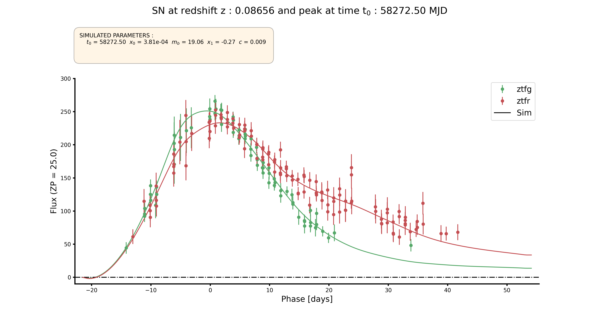
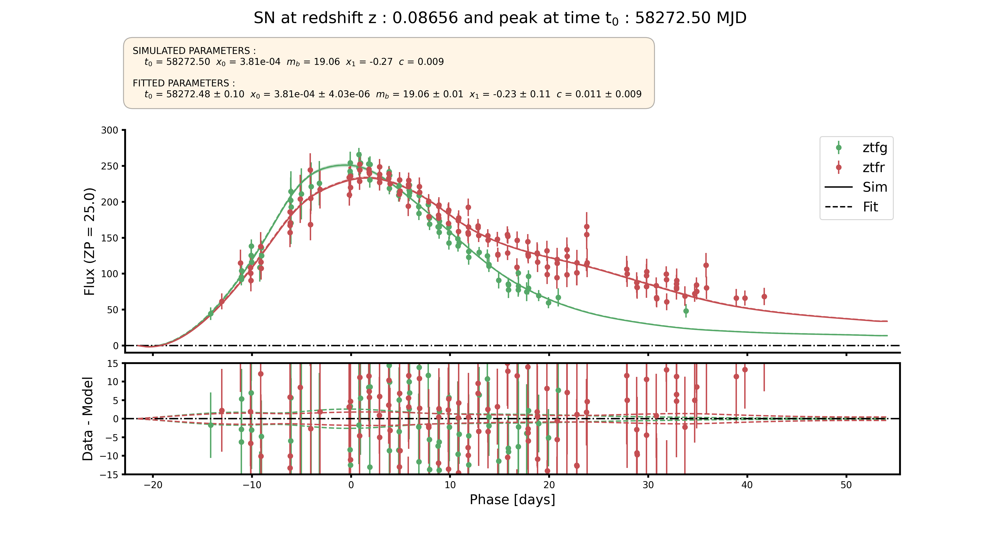
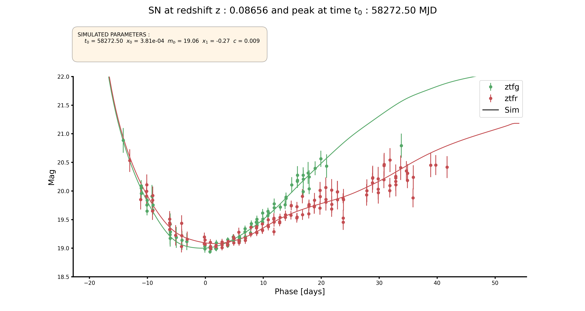
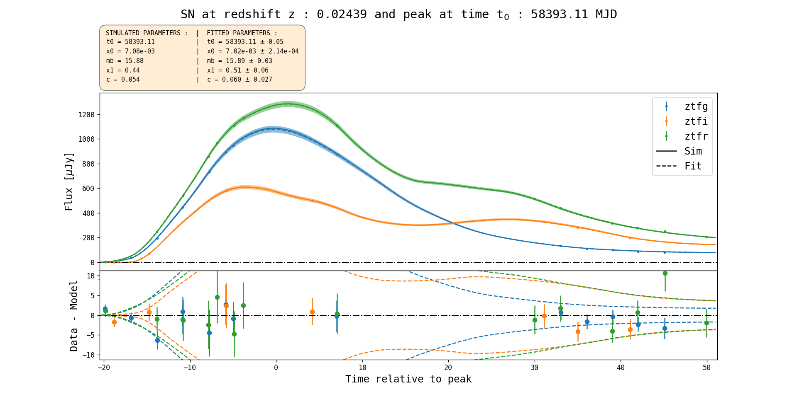
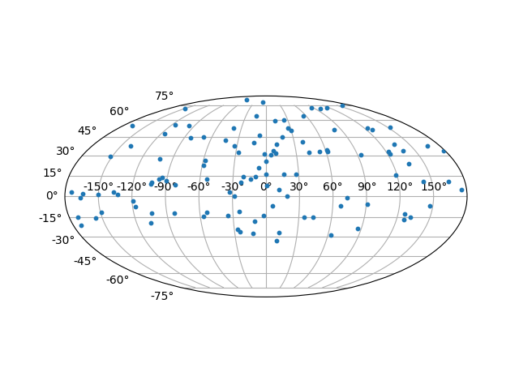

# Plots 

## Light-curves

You can plot light-curves directly after simulation or using the **OpenSim** module.

```python
sim.plot_lc(SN_ID, mag=False, zp=25. , plot_sim=True, plot_fit=False, Jy=False)
```

Plot sim :



Plot  fit :




The same plot can be show in magnitude :



Or in Jansky :




## Mollweide map

You can plot the  directly after simulation or using the **OpenSim** module. But the **plot_field** option doesn't work with **OpenSim**.

You can pass **kwargs** for *matplotlib* scatter function.

```python
sim.plot_ra_dec(plot_vpec=False, plot_fields=False, **kwarg)
```

Plot without peculiar velocities :



Plot with peculiar velocities :


Adding the fields :

